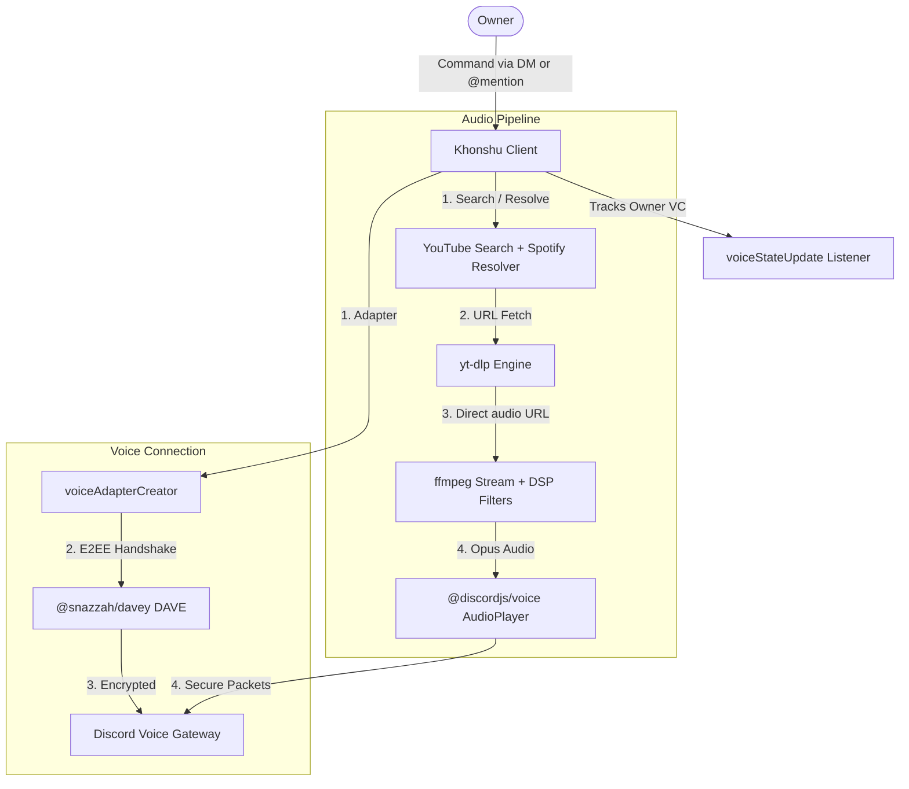

<div align="center">

# 🌙 Khonshu

**A premium, end-to-end encrypted Discord selfbot music player.**

[](https://nodejs.org)
[](https://discord.com)
[](LICENSE)
[](#-dokploy-deployment)

*Streams high-fidelity audio directly from YouTube & Spotify via yt-dlp + ffmpeg, secured with Discord's DAVE E2EE protocol.*

</div>

---

## ✨ Features

| Feature | Description |
|:---|:---|
| 🔒 **DAVE E2EE Compliance** | Fully supports Discord's mandatory end-to-end encryption for user accounts via `@snazzah/davey` |
| 📺 **Go Live Video Streaming** | Stream high-definition YouTube videos as a Discord screenshare (Go Live) natively |
| ⚡ **Ultra-Smooth Playback** | Two-stage streaming — `yt-dlp` pre-fetches direct URLs, `ffmpeg` streams with reconnect & buffering |
| 🟢 **Spotify Support** | Paste any Spotify track, playlist, or album link — auto-resolved to YouTube and played instantly |
| 🎛️ **DSP Audio Filters** | Real-time audio effects: Bassboost, Nightcore, Vaporwave, 8D — stackable and toggleable |
| ✉️ **DM + Server Commands** | Control via `@mention` in servers or direct message to the bot account |
| 🔀 **Smart Shuffle** | Fisher-Yates shuffle algorithm keeps the current song playing while randomizing the queue |
| 📄 **Paginated Queue** | Clean 10-tracks-per-page display with now-playing header and active filter info |
| ⏱️ **Auto-Disconnect** | Leaves voice channel after 5 minutes of inactivity to save resources |
| 🔊 **Pre-set Volume** | Configure volume before playing — next song automatically starts at your chosen level |
| 🚫 **Link-Free Responses** | Clean status messages without embeds or URLs that could get blocked |
| 👑 **Owner-Locked** | Only responds to the configured owner account |
| 🐳 **Dokploy Ready** | Multi-stage Docker build, deploy in one click with environment variables |

---

## 🏗️ Architecture



---

## ⌨️ Command Reference

| Command | Aliases | Description |
|:---|:---|:---|
| `$play <query/URL>` | `$p` | Play audio from YouTube search, YouTube URL, or Spotify link |
| `$vplay <query/URL>` | `$vp` | Stream YouTube video (Go Live screenshare by default) |
| `$stop` | `$st` | Stop playback, clear queue, and leave VC |
| `$skip` | `$s` | Skip to the next track in queue |
| `$join` | `$j` | Move bot to your current VC (resumes playback) |
| `$loop` | `$l` | Toggle loop on the current track |

### 📋 Queue Management
| Command | Aliases | Description |
|:---|:---|:---|
| `$queue [page]` | `$q` | View the queue with pagination (10 per page) |
| `$shuffle` | `$sh`, `$random` | Shuffle all queued tracks randomly |
| `$clear` | — | Clear the entire queue (keeps the current track) |

### 🎛️ DSP Audio Filters
| Command | Aliases | Description |
|:---|:---|:---|
| `$filter` | `$f`, `$fx`, `$effect` | Show currently active filters |
| `$filter list` | | Show active + available filters |
| `$filter bassboost` | | Toggle heavy low-end bass boost |
| `$filter nightcore` | | Toggle 1.25× speed + higher pitch |
| `$filter vaporwave` | | Toggle 0.8× speed + lower pitch |
| `$filter 8d` | | Toggle audio panning left ↔ right |
| `$filter clear` | `off`, `reset` | Remove all active filters |

> **Tip:** Filters are stackable! Enable multiple at once (e.g. `$filter bassboost` then `$filter nightcore`). On the ffmpeg pipeline the current track is restarted to apply the chain; on the Lavalink pipeline they're applied live via `player.setFilters`.

### 🔊 Volume
| Command | Aliases | Description |
|:---|:---|:---|
| `$volume <0.1 - 10>` | `$v` | Set playback volume (1 = 100%) — works even without a song playing (pre-set) |
| `$volume earrape` | | Temporary 100× volume blast for 7s (requires ✅ reaction from you) |

### 🎥 Video Streaming Flags (`$vplay` / `$vp`)
| Form | Description |
|:---|:---|
| `$vplay <query/URL>` | Default: Go Live screenshare |
| `$vplay -s <query/URL>` | Screenshare (aliases: `--screenshare`, `--go-live`, `--live`) |
| `$vplay -c <query/URL>` | Virtual Camera (aliases: `--camera`, `--cam`) |
| `$vplay obs <query/URL>` | Route through OBS Virtual Camera device |
| `$vplay camera <query/URL>` | Same as `obs` (shortcut: `cam`) |

### 🎯 Targeted Playback
| Command | Aliases | Description |
|:---|:---|:---|
| `$rplay <guildId> <channelId> <query/URL>` | `$rp`, `$remoteplay` | Play in any guild + VC by ID. Tears down the current session if it's running in a different location. |
| `$uplay @user <query/URL>` | `$up`, `$userplay` | Jump to the target user's current VC and play. Tears down the current session if it's running elsewhere. |

### 🌐 Server Management (`$server`)
| Command | Aliases | Description |
|:---|:---|:---|
| `$server list` | `$joinserver`, `$invite` | List all servers the bot account is in (top 25 by member count) |
| `$server info <invite>` | | Preview a server without joining |
| `$server leave <guildId>` | | Leave a server |

> **Note:** Auto-accepting invites via the API is disabled — Discord treats it as a selfbot detection signal. Use `$server info <invite>` to preview, then join manually from your Discord client.

### ℹ️ Info
| Command | Aliases | Description |
|:---|:---|:---|
| `$help` | `$h`, `$menu`, `$commands` | Show the full command menu |

---

## 📺 Video Streaming ($vplay)

Khonshu features a **video streaming engine** that broadcasts high-definition YouTube video streams directly into Discord voice channels. Two output modes:

### 1. 📺 Screenshare Mode — Go Live (Default)
Streams via Discord's official **Go Live** feature. This is the default when no flag is provided, or when any of `-s`, `--screenshare`, `--go-live`, or `--live` is present.
```
$vplay https://youtu.be/4vI3mOS9gIo
$vp LOFI hiphop radio -s
$vp https://youtu.be/4vI3mOS9gIo --screenshare
```

### 2. 📷 Virtual Camera Mode
Streams video as a Virtual Camera feed over the primary voice channel socket. Activated with `-c`, `--camera`, or `--cam`; also via the `obs` / `camera` / `cam` device shortcuts (which route through an OBS Virtual Camera device on the host).
```
$vplay https://youtu.be/4vI3mOS9gIo -c
$vp LOFI hiphop radio --camera
$vp obs https://youtu.be/4vI3mOS9gIo
```

### Key Technical Specs:
- **Video Format:** H264 AVC (1280x720 @ 30 FPS / 2-3 Mbps)
- **Audio Format:** High-fidelity secure Opus audio
- **E2EE Handshake:** Natively encrypted with the DAVE protocol on both primary voice and secondary video streams, preventing black screens or frozen feeds on modern Discord clients.

---

## 🟢 Spotify Support

Paste any public Spotify link and Khonshu handles the rest — **no API keys required**.

```
$play https://open.spotify.com/track/4cOdK2wGLETKBW3PvgPWqT
$play https://open.spotify.com/playlist/37i9dQZF1DXcBWIGoYBM5M
$play https://open.spotify.com/album/4aawyAB9vmqN3uQ7FjRGTy
```

**How it works:**
- **Tracks** → Resolves artist + title, searches YouTube, plays immediately
- **Playlists & Albums** → Plays the first track **instantly**, queues the rest in the background with progress updates

---

## 🚀 Setup & Installation

### Prerequisites
- **Node.js** v20+ 
- **Python 3.x** (for yt-dlp)
- **FFmpeg** (bundled via `ffmpeg-static` or install system-wide)

### Local Installation

```bash
# Clone the repository
git clone https://github.com/k4ran909/khonshu.git
cd khonshu

# Install Node.js dependencies
npm install

# Install yt-dlp
pip install -U yt-dlp
```

### Configuration

**Option A — Config file** (for local development):

Create `config.js` in the root directory:
```javascript
module.exports = {
    token: "YOUR_DISCORD_USER_TOKEN",
    prefix: "$",
    owner: "YOUR_DISCORD_USER_ID"
};
```

**Option B — Environment variables** (for Docker/Dokploy):

| Variable | Description | Required | Default |
|:---|:---|:---|:---|
| `TOKEN` | Discord user token | ✅ | — |
| `OWNER` | Your Discord user ID | ✅ | — |
| `PREFIX` | Command prefix | ❌ | `$` |

### Start the Bot

```bash
npm start
```

---

## 🐳 Dokploy Deployment

Khonshu ships with a production-ready, multi-stage `Dockerfile` optimized for [Dokploy](https://dokploy.com).

### Step 1 — Create Application
1. Open your Dokploy dashboard → **Create Project** → **Add Application**
2. Source: **GitHub** → select `k4ran909/khonshu` → branch `main`
3. Build type: **Dockerfile** (auto-detected)

### Step 2 — Set Environment Variables
In the **Environment** tab, add:

```env
TOKEN=your_discord_user_token_here
OWNER=your_discord_user_id_here
PREFIX=$
```

### Step 3 — Deploy
Hit **Deploy** — Dokploy will:
1. Compile native modules (`sodium-native`, `better-sqlite3`) in the builder stage
2. Install runtime dependencies (`ffmpeg`, `yt-dlp`) in the final image
3. Start the bot automatically

> **Security:** Your token is only stored in Dokploy's encrypted environment variables. `config.js` is excluded from the Docker image via `.dockerignore`.

---

## 🛡️ How DAVE E2EE Works

Discord now enforces **DAVE (Discord Audio & Video Encryption)** on all user accounts. Traditional solutions like Lavalink cannot implement this protocol, causing audio to silently drop.

Khonshu solves this using [`@snazzah/davey`](https://github.com/snazzah-dev/davey), a Rust/NAPI-RS compiled library that performs the E2EE handshake natively:

```
User Account → Voice Gateway → DAVE Handshake (via davey) → Encrypted Audio Channel → Playback
```

This is fully transparent — you don't need to configure anything. The library is auto-detected by `@discordjs/voice` v0.19+.

---

## 🧰 Tech Stack

| Technology | Purpose |
|:---|:---|
| [discord.js-selfbot-v13](https://github.com/aiko-chan-ai/discord.js-selfbot-v13) | Discord client for user accounts |
| [@discordjs/voice](https://github.com/discordjs/voice) | Voice connection management |
| [@snazzah/davey](https://github.com/snazzah-dev/davey) | DAVE E2EE protocol adapter |
| [yt-dlp](https://github.com/yt-dlp/yt-dlp) | YouTube audio URL extraction |
| [ffmpeg](https://ffmpeg.org/) | Audio transcoding & DSP filters |
| [spotify-url-info](https://github.com/microlinkhq/spotify-url-info) | Spotify metadata resolver (no API keys) |
| [youtube-sr](https://github.com/DevAndromeda/youtube-sr) | YouTube search |
| [sodium-native](https://github.com/sodium-friends/sodium-native) | Encryption primitives |

---

## 📁 Project Structure

```
khonshu/
├── commands/
│   ├── play.js        # YouTube + Spotify playback
│   ├── vplay.js       # YouTube Go Live / Virtual Camera video streaming
│   ├── stop.js        # Stop and leave VC
│   ├── skip.js        # Skip current track
│   ├── join.js        # Move bot to your VC (preserves ffmpeg / Lavalink pipeline)
│   ├── queue.js       # Paginated queue display
│   ├── shuffle.js     # Fisher-Yates queue shuffle
│   ├── filter.js      # DSP audio filter toggles (ffmpeg + Lavalink)
│   ├── volume.js      # Volume control (pre-set supported, earrape mode)
│   ├── loop.js        # Loop toggle
│   ├── clear.js       # Clear queue
│   ├── rplay.js       # Remote play in any guild+VC by ID
│   ├── uplay.js       # Jump to a target user's VC and play
│   ├── server.js      # List/info/leave servers (no auto-accept invites)
│   └── help.js        # Full command menu
├── events/
│   ├── messageCreate.js  # Command parser (DM + mention)
│   └── ready.js          # Startup voice state detection
├── index.js           # Bot entry point
├── patch-stream.js    # DAVE E2EE video/voice patcher script
├── utils.js           # Audio pipeline, voice, DSP filters
├── lavalink.js        # Optional Shoukaku / Lavalink integration
├── config.js          # Local config (gitignored)
├── config.example.js  # Config template
├── strings.json       # Response messages
├── Dockerfile         # Multi-stage Docker build
├── package.json       # Dependencies
└── .dockerignore      # Docker exclusions
```

---

## 🛠️ Changelog — `dev`

Recent fixes and improvements on the `dev` branch:

### Bug fixes
- **ffmpeg fallback with no voice connection** — When Lavalink reported connected but failed to resolve/join a track, playback fell through to the ffmpeg pipeline with a `null` voice connection, so audio played to nowhere while the queue silently advanced. The fallback now establishes a voice connection on demand (`utils.js`).
- **Cookie path mismatch** — Cookies were written to the project root (`__dirname`) but read from `process.cwd()`, so auth silently broke when the process was launched from another working directory. All readers now anchor to the project root (`utils.js`, `commands/vplay.js`).
- **`$help` / `$menu` never sent** — The menu exceeded Discord's 2000-character message limit and threw `Invalid Form Body` every time. It's now split into multiple messages on section boundaries (`commands/help.js`).
- **`pendingVolume` leak** — A one-off `$volume` set before playback leaked as the default for every subsequent session. `$play` now consumes and clears it (0 preserved) like `rplay`/`uplay` (`commands/play.js`).
- **Invidious instance cache never cached** — `vplay`'s Invidious resolver never stamped its cache timestamp, forcing a fresh 8s registry fetch on every video request (`commands/vplay.js`).
- **`ALLOWED` env parsed as a string** — Normalized to a trimmed array to match the file/default config branches (`index.js`).

### Video streaming (`$vplay`)
- **Removed event-loop-blocking debug logging** — The camera/screenshare path was emitting hundreds of synchronous `console.log` lines per second (server-wide voice-state JSON dumps, per-frame `[DAVE VIDEO STATE]`, per-packet `[DAVE DEBUG]`). On Windows these block the event loop that paces UDP video packets. The raw-gateway listener is now guild-scoped and minimal, and the per-frame/packet debug blocks are disabled (`commands/vplay.js`, `patch-stream.js`).
- **Camera tuning** — Output capped to a steady 30fps and the camera video bitrate floor raised (600 → 1500 kbps) for cleaner playback on dark/complex scenes (`commands/vplay.js`).

### Hardening
- `.gitignore` now excludes `cookies.txt` and other local runtime artifacts so secrets never reach the repo.

---

## 📜 License

This project is licensed under the [MIT License](LICENSE).

---

<div align="center">

**Built with 🌙 by Khonshu**

</div>
